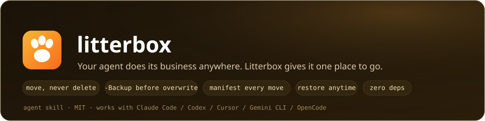

<p align="center">
  <strong>English</strong> · <a href="./README.md">简体中文</a>
</p>

<p align="center">
  
</p>

<p align="center">
  
  
  
  
  
</p>

<p align="center">
  
  
  
</p>

<p align="center"><em>Your agent does its business anywhere. Litterbox gives it one place to go.</em></p>

You know the scene: the agent finishes, and your project has grown `scratch_test.py`, `debug_dump.txt`, `output_final_v2.json` — scattered across root, src, and tmp. Deleting? The agent often **lacks permission**. Cleaning it yourself? First, archaeology on what the agent actually did today.

Litterbox is a workspace-hygiene skill that gives the agent a fixed routine:

1. **Move, never delete** — moving almost always works; deleting may not. All litter goes to **`-Delete/`** at the workspace root; you skim the manifest and empty it when satisfied.
2. **Backup before overwrite** — any time the agent replaces an existing file, the original is snapshotted into **`-Backup/<timestamp>/<original-path>/`** first. Old versions are always recoverable.
3. **Every move is logged** — each bucket has a `MANIFEST.md`: original path, destination, reason, and permission failures marked "needs manual deletion".
4. **Installs stay in the project** — create `.venv` / use the project's `package.json` before installing anything; anything that leaked into a global environment (including a previous session's leftovers) is ledgered with package and **uninstall command**.
5. **Secrets get flagged** — debug dumps often contain API keys; the agent scans before archiving and marks the manifest `CONTAINS SECRETS` so you empty that bucket first.
6. **Restore is one copy command** — the manifest records the original path. No tooling, no lock-in.

The leading dash keeps both folders **sorted above everything else** in your file browser — the first thing you see is exactly how much litter the agent left this time.

## What it enforces

| Without | With |
|---|---|
| `rm -rf scratch* 2>/dev/null` then declare "cleanup done" (permission failures silently swallowed) | Move only; anything unmovable is logged as "needs manual deletion" |
| Litter scattered in root forever, kept "just in case" | End-of-task sweep; `-Delete/` is reviewable and reversible |
| `config.yaml` overwritten in place, old version gone | Snapshot to `-Backup/<timestamp>/` before any overwrite |
| `legacy_export.py` looks unused → moved → build breaks | Grep for references before moving; referenced files stay and are reported |
| The bucket itself becomes a second junk drawer | Every move appends a manifest line — auditable, restorable |
| `pip install` straight into the system environment, untraceable | `.venv` / project manifest first; global leaks get ledgered with uninstall commands |
| `.venv` / `node_modules` archived or wiped carelessly | Regenerables are never archived: lockfile confirmed, sizes reported, you decide |
| API keys inside debug dumps ride along into the bucket | Secrets scan before archiving; manifest marked `CONTAINS SECRETS` |

The full discipline — classification rules, the never-touch list, and five anti-patterns with Before/After examples — is in [`SKILL.md`](SKILL.md).

## Install

```bash
npx skills add cv-superding/litterbox --global
```

Claude Code 2.1.142+ can also install it as a plugin:

```text
/plugin marketplace add cv-superding/litterbox
/plugin install litterbox@litterbox
```

Manual install: copy `SKILL.md` into your agent's skills folder.

## Usage

Nothing to learn. The skill triggers when a task that created scratch files finishes, or whenever you say "clean up" / "the project is a mess". Call it explicitly if you like:

```text
/litterbox
Sweep this session's litter into the buckets.
```

Shell tip: leading-dash folders need a `./` prefix in commands: `mv scratch_test.py ./-Delete/`.

## Restore

```bash
cat ./-Backup/MANIFEST.md          # find the original path
cp -r "./-Backup/2026-09-13_1542/src/config.yaml" src/config.yaml
```

## License

MIT
